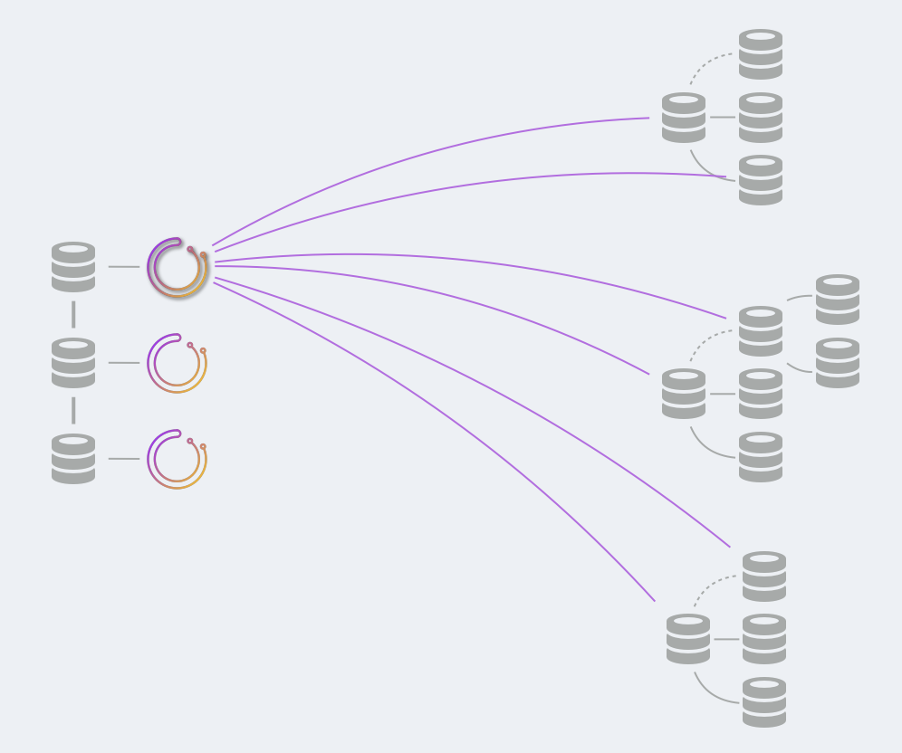

# shard backend模式部署
# [Orchestrator deployment: shared backend](https://github.com/openark/orchestrator/blob/master/docs/deployment-shared-backend.md)
本文描述了shared backend数据库的部署方法. 有关各种后端DB设置，请参阅[Orchestrator高可用](Deployment/Orchestrator高可用.md).

这篇文的完善了[在生产环境中部署Orchestrator](Deployment/在生产环境中部署Orchestrator.md).

### Shared backend
你将需要创建一个shared backend database. 这可以是同步复制(Galera/XtraDB Cluster/InnoDB Cluster), 以实现高可用性, 也可以是主从复制.

后端数据库具有你的拓扑结构的状态. `orchestrator`本身几乎是无状态的, 并且信任后端数据库中的数据.

> The backend database has the *state* of your topologies. `orchestrator` itself is almost stateless, and trusts the data in the backend database.

在shard backend模式部署中, 所有`orchestrator` 服务将全部与同一个后端通信.

* 对于同步复制(**synchronous replication**), 建议是:
   * 配置多写模式(数据库集群的每个节点都是可写的)
   * `orchestrator`和MySQL节点之间是1:1映射的: 每个`orchestrator`服务与自己的后端数据库节点对话
* 对于主从复制(异步 & 半同步), 请执行以下操作:
   * 配置所有`orchestrator`节点访问同一个后端数据库节点(即, 主库)
   * 你可以通过代理(proxysql)将引导流量到主库, 在这种情况下, 配置所有`orchestrator`节点访问代理即可.

### MySQL backend setup and high availability
设置后端数据库是你的责任. 另外, `orchestartor` doesn't eat its own dog food, 也不能恢复自己后端数据库的故障. 你将需要处理, 例如, 添加Galera节点的问题, 或管理你的代理健康检查等.

### What to deploy: service
* 将`orchestrator`服务部署到服务盒上. 部署多少个服务盒将取决于你的可用性需求.
>  Deploy the `orchestrator` service onto service boxes. The decision of how many service boxes to deploy will depend on your[Orchestrator高可用](Deployment/Orchestrator高可用.md)
   * In a synchronous replication shared backend setup, these may well be the very MySQL boxes, in a `1:1` mapping. 如果后端数据库采用同步复制(MGR/PXC), 那么`orchestrator` 服务数量和后端数据库集群节点数应该是1:1的. `orchestrator` 应该可以直接部署在后端数据库服务器上.
* 考虑在服务盒(service boxes)之上增加一个代理(proxy);代理最好能将所有流量重定向到leader node(这里指的是`orchestrator` 服务leader节点). 有一个而且只有一个领导者节点, 状态检查的端点是`/api/leader-check` . 可以将流量导向任何健康的(`orchestrator`)服务. 由于所有`orchestrator`节点都与相同的共享后端数据库通信, 因此可以从一个服务节点执行一些操作, 从另一个服务节点执行其他操作. 内部锁是为了避免运行相互矛盾或干扰的命令.

### What to deploy: client
为了通过shell/automation/scripts与`orchestrator`进行交互, 你可以选择:

* 直接与HTTP API交互
* 使用[orchestrator-client](Use/orchestrator-client.md)脚本([orchestrator-client](Use/orchestrator-client.md)本质是一个shell脚本).
   * 将`orchestrator-client`部署在你希望与`orchestrator`交互的任何盒子上.
   * Create and edit `/etc/profile.d/orchestrator-client.sh` on those boxes to read:

```bash
ORCHESTRATOR_API="http://your.orchestrator.service.proxy:80/api"
# 代理
```
or

```bash
ORCHESTRATOR_API="http://your.orchestrator.service.host1:3000/api http://your.orchestrator.service.host2:3000/api http://your.orchestrator.service.host3:3000/api"
# 指定所有orchestrator
```
在后一种情况下, 你将提供所有`orchestrator`节点的列表, 而`orchetsrator-client`脚本将自动计算出哪个是leader. 通过这种设置, 你的自动化将不需要代理（尽管你可能仍然希望为Web界面用户使用代理）.

确保 chef/puppet/whatever 的 `ORCHESTRATOR_API` 值能够适应环境的变化.

* [orchestrator命令](Use/Executing%20via%20command%20line.md)
   * 将`orchestrator`二进制文件（你可以使用`orchestrator-cli`distributed package）部署在你希望与`orchestrator`互动的任何盒子上.
   * 在这些盒子上创建`/etc/orchestrator.conf.json`，用证书填充(populate with credentials). 该文件一般应与`orchestrator`服务盒的文件相同. 如果你不确定, 请使用完全相同的文件内容.
   * `orchestrator`命令将访问共享的后端数据库. 请确保给予它访问权. 通常情况下, 这将是3306端口.

即使在`orchestrator`服务运行时, 运行orchestrator CLI也是可以的, 因为它们都将在相同的后端DB上进行协调.

### Orchestrator service
In a shared-backend deployment, 你可以根据你的需求部署所需数量的`orchestrator` 节点.

然而, 如前所述, 只有一个`orchestrator`节点将被选为领导者. 只有领导者会:

* 发现（探测）你的MySQL拓扑结构
* 运行故障检测
* 运行故障恢复

所有节点都:

* 提供HTTP请求

* Register their own health check 注册自己的健康检查

所有节点都可以:

* Run arbitrary command (e.g. `relocate`, `begin-downtime`)  (运行任意命令?)

* Run recoveries per human request. (按人的要求运行恢复)
有关部署多个节点的详细信息，请阅读有关[Orchestrator高可用](Deployment/Orchestrator高可用.md)的内容.

### Orchestrator CLI
CLI执行以完成特定的操作. 它可以选择探测一些服务器, 这取决于操作(e.g. `relocate`), 也可以根本不探测服务器, 只从后端数据库读取数据.

### A visual example


在上面图中, 有三个`orchestrator`节点运行在3个节点的同步复制设置之上. 每个`orchestrator`节点都与不同的MySQL后端通信, 但是这些节点都是同步复制的, 并且都共享相同的数据(有一定的延迟).

一个`orchestrator`节点被选为leader, 并且只有这个节点探测MySQL拓扑. 它会探测所有已知的服务器(上面的图片只显示了部分探测，以避免意大利面. (他意思应该是图上画太多线了, 向意大利面一样乱))
