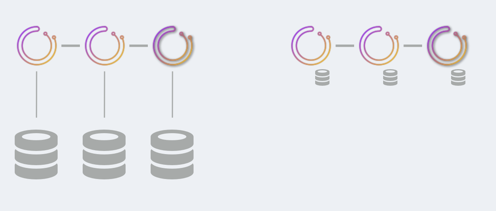
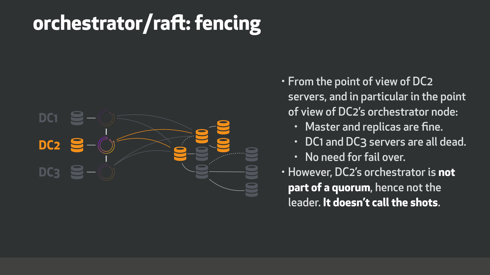
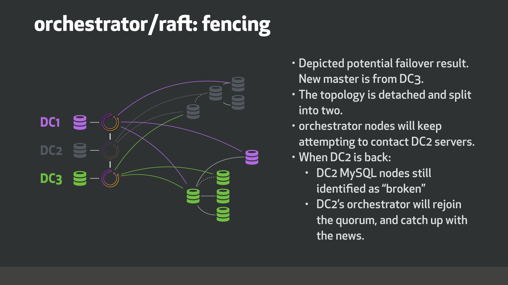

# Orchestrator/raft, consensus cluster
# [Orchestrator/raft, consensus cluster](https://github.com/openark/orchestrator/blob/master/docs/raft.md)


`orchestrator/raft` 是一种部署方法, 集群中的`orchestrator` 节点通过`raft` 共识协议相互通信.

`orchestrator/raft`的部署既解决了`orchestrator`本身的高可用性, 也解决了网络隔离的问题, 特别是跨数据中心的网络分区/围栏问题(network partitioning/fencing).

> 译者注: 根据华为云文档:[区域和可用区](https://support.huaweicloud.com/productdesc-bms/bms_01_0004.html), 同区域（Region）中的不同可用区（AZ，Availability Zone）的服务器在不同的机房. 一个Region中的多个AZ间通过高速光纤相连. AZ间延迟没有官方, 华为工作人员反馈测试在0.5ms左右


> 所以, 像broker集群, 其实现在已经是两地三中心部署了. bj1与bj2其实就是跨数据中心了, 华为文档说的很清楚了, [AZ有独立的风火水电](https://blog.csdn.net/wangjianno2/article/details/52145197)


### Very brief overview of traits of raft -- raft特点的简要概述
通过使用共识协议, `orchestrator`节点能够挑选一个拥有*quorum(*法定人数)的领导者, 这意味着它不是孤立的. 例如, 考虑一个3个节点的`orchestrator/raft`setup. 通常情况下, 这三个节点会互相通信, 其中一个会成为稳定的当选领导者. 然而, 面对网络分区, 比如说节点`n1`与节点`n2`和`n3`分开, 可以保证领导者将是`n2`或`n3`. `n1`将无法领导, 因为它没有*quorum(*法定人数)(在3个节点设置中, *quorum*法定人数是2; 在5个节点设置中, *quorum*法定人数是3）

这在跨数据中心(DC)的设置中变得非常有用. 假设你设置了三个`orchestrator`节点, 每个都在自己的DC上. 如果一个DC被隔离, 可以保证活动的`orchestrator`节点将是一个有共识的节点, 即从被隔离的DC之外操作( i.e. operates from outside the isolated DC).

### orchestrator/raft setup technical details 技术细节
另见: [orchestrator/raft vs. synchronous replication setup](https://github.com/Fanduzi/orchestrator-chn-doc/blob/master/Setup/部署/orchestrator%20raft%20vs.%20synchronous%20replication%20setup.md)

#### Service nodes
你将设置`3`个或`5`个(推荐raft节点数)`orchestrator`节点. 其他数字也是合法的, 但你将希望至少有3个.

此时, `orchestrator`节点不会动态加入到集群中. 节点的列表是预先配置好的, 如:

```yaml
  "RaftEnabled": true,
  "RaftDataDir": "/var/lib/orchestrator",
  "RaftBind": "<ip.or.fqdn.of.this.orchestrator.node>",
  "DefaultRaftPort": 10008,
  "RaftNodes": [
    "<ip.or.fqdn.of.orchestrator.node1>",
    "<ip.or.fqdn.of.orchestrator.node2>",
    "<ip.or.fqdn.of.orchestrator.node3>"
  ],
```
#### Backend DB
每个`orchestrator`节点都有自己专用的后端数据库服务器. 这可能是:

* MySQL(不需要配置从库, 不过有也没事)
根据部署建议, MySQL可以与`orchestrator` 运行在同一主机上.
* SQLite:

```yaml
  "BackendDB": "sqlite",
  "SQLite3DataFile": "/var/lib/orchestrator/orchestrator.db",
```
`orchestrator`与`sqlite`捆绑在一起, 不需要安装外部依赖.

#### Proxy: leader
Only the leader is allowed to make changes.

最简单的设置是, 通过在`orchestrator`服务上设置一个`HTTP`代理(如HAProxy), 只将流量路由到领导者.

> 另一种方法请见[orchestrator-client](https://github.com/Fanduzi/orchestrator-chn-doc/blob/master/Setup/%E9%83%A8%E7%BD%B2/Orchestrator%20raft%2C%20consensus%20cluster.md#orchestrator-client)

* 使用`/api/leader-check` 做健康检查. 在任何时候, 最多只有一个`orchestrator`节点会以`HTTP 200/OK`回复该检查; 其他节点会以`HTTP 404/Not found` 回复.
   * Hint: 你可以使用, 例如, `/api/leader-check/503`是你明确希望获得503响应代码, 或类似的任何其他代码.
* 只将流量导向通过该测试的节点(指`/api/leader-check` )

作为例子, 这将是一个`HAProxy`的配置:

```bash
listen orchestrator
  bind  0.0.0.0:80 process 1
  bind  0.0.0.0:80 process 2
  bind  0.0.0.0:80 process 3
  bind  0.0.0.0:80 process 4
  mode tcp
  option httpchk GET /api/leader-check
  maxconn 20000
  balance first
  retries 1
  timeout connect 1000
  timeout check 300
  timeout server 30s
  timeout client 30s

  default-server port 3000 fall 1 inter 1000 rise 1 downinter 1000 on-marked-down shutdown-sessions weight 10

  server orchestrator-node-0 orchestrator-node-0.fqdn.com:3000 check
  server orchestrator-node-1 orchestrator-node-1.fqdn.com:3000 check
  server orchestrator-node-2 orchestrator-node-2.fqdn.com:3000 check
```


#### Proxy: healthy raft nodes
对上述制约因素的放松

> A relaxation of the above constraint.

健康的raft节点将反向代理你的请求给领导者. 你可以选择(对于kubernetes设置来说, 这恰好是可取的)与任何健康的raft成员交谈.

你不能访问*unhealthy*的raft成员, 即与*quorum*法定人数隔离的节点.

> You *must not access unhealthy raft members, i.e. nodes that are isolated from the quorum*.

* 使用`/api/raft-health`来识别一个节点是健康raft组的一部分
* `HTTP 200/OK`的响应表明该节点是健康组的一部分, 你可以将流量导向该节点.
* `HTTP 500/Internal Server Error`表明该节点不是健康组的一部分. 请注意, 在启动之后, 直到选出一个领导者, 你可能会发现有一段时间所有节点都报告为unhealthy. 请注意, 在领导者重新选举时, 你可能会观察到一个短暂的时期, 所有节点都报告为unhealthy.


#### orchestrator-client
实现代理的另一种方法是使用`orchestrator-client`.

[orchestrator-client](https://github.com/Fanduzi/orchestrator-chn-doc/blob/master/Use/orchestrator-client.md)是一个shell脚本, 通过HTTP API访问`orchestrator` 服务, 并向用户提供一个命令行界面.

可以向`orchestrator-client`提供所有orchestrator API endpoints的完整列表. 在这种情况下, `orchestrator-client`会找出哪个endpoints是leader, 并将请求指向该endpoints.

例如:

```bash
export ORCHESTRATOR_API="https://orchestrator.host1:3000/api https://orchestrator.host2:3000/api https://orchestrator.host3:3000/api"
```
A call to `orchestrator-client` will first check ( 译者: 这句话没懂, 好像没写完一样)

否则, 如果你已经有一个代理, 也可以让`orchestrator-client`与代理一起工作, 例如:

```bash
export ORCHESTRATOR_API="https://orchestrator.proxy:80/api"
```
### Behavior and implications of orchestrator/raft setup  行为和影响
* 在`raft`模式中, 每个`orchestrator`节点独立运行所有服务器的发现. 这意味着在三个节点的`orchestrator`集群中, 你的每个MySQL拓扑服务器将被三个不同的`orchestrator`节点独立访问.
* 在正常情况下, 这三个节点将看到一个或多或少相同的拓扑结构图. 但他们将各自有自己的独立分析.
* 每个`orchestrator`节点都向自己的专用后端DB服务器(无论是`MySQL`还是`sqlite`)写入数据.
* `orchestrator`节点间的通信非常少. 它们不共享发现信息(因为它们各自独立发现). 相反, leader与其他节点共享被拦截的用户指令, 例如:
   * `begin-downtime`
   * `register-candidate`
   * etc.

The *leader* will also educate its followers about ongoing failovers.

> 译者注: 就是说failover只能leader做, leader做failover时也会告诉followers呗.

`orchestrator`节点之间的通信与事务性数据库的提交不相关, 而且是稀疏的.

* 所有用户变更必须通过leader, 尤其是通过`HTTP API`. 你不能直接操作后台数据库, 因为这样的改变不会被发布到其他节点.
* 因此, 在`orchestrator/raft`上, 人们不能在命令行模式下使用`orchestrator` 命令: 当raft模式被启用时, 试图运行orchestrator cli将被拒绝. 我们正在进行的一些开发工作是允许一些命令通过cli运行.
* 有一个实用脚本, 即[orchestrator-client](https://github.com/Fanduzi/orchestrator-chn-doc/blob/master/Use/orchestrator-client.md), 它提供了与`orchestrator`命令类似的接口, 并使用和操作`HTTP API` .
* 只需在`orchestrator`服务节点上安装`orchestrator`二进制文件即可, 无需在其他地方安装. 而`orchestrator-client`可以安装在您希望安装的任何地方.
* 单个`orchestrator`节点的故障将不会影响`orchestrator`的可用性. 在`3`个节点的集群中, 最多在只能有一个`orchestrator`节点发生故障. 在`5`个节点的设置中, 允许`2`个节点发生故障.
* 如果没有后端数据库, `orchestrator`节点将无法运行. 对于使用 `sqlite` 后端, 这是微不足道的(感觉意思是使用sqlite几乎不用担心数据库故障引发orchestrator panic), 因为 `sqlite` 嵌入在 `orchestrator`中一起运行.  如果使用 `MySQL` 作为后端数据库,  假设在一段时间内`orchestrator`无法连接到后端 DB, 那么 `orchestrator` 服务将退出.
* `orchestrator`节点可能会宕机, 然后恢复. (当它恢复时)它将重新加入`raft`组, 并接收它在离开时错过的任何事件. 节点离开多长时间并不重要. 如果它没有相关的本地`raft`log/snapshots, 另一个节点将自动为它提供最近的快照.
* 如果无法加入 `raft` 组, 那么 `orchestrator` 服务将退出.

See also [KV and orchestrator/raft](https://github.com/Fanduzi/orchestrator-chn-doc/blob/master/Failure%20detection%20%26%20recovery/Key-Value%20stores.md#kv-and-orchestratorraft) via `orchestrator/raft`.

### Main advantages of orchestrator/raft 主要优势
* 高可用
* 共识: 故障转移是由作为法定人数成员的领导节点进行的（而不是被孤立的节点进行的）
* 支持使用`SQLite` (嵌入式)作为后端数据库, 不必非要使用`MySQL` 作为后端数据库(尽管也支持).
* 几乎没有跨节点通信. 适用于高延迟跨DC网络环境.

### DC fencing example
考虑以下三个数据中心的示例: `DC1`、`DC2`和`DC3`. 我们使用三个节点运行`orchestrator/raft`, 每个数据中心都有一个`orchestrator`节点.


* 假设一个跨3数据中心部署的集群
* 每个数据中心部署一个`orchestrator`节点
* 主库和一部分从库在DC2
故障场景是: 网络分区. 例如DC2网络出现问题, 没有任何进出流量

What happens when `DC2` gets network isolated?



* 从DC2的角度来看
从server的角度来看, 特别是从在DC2的`orchestrator`节点的角度来看:
   * 主库和DC2的从库是正常的
   * DC1和DC3的server都挂了
   * (因为主库是"正常的"的)所以没必要failover
* 然而, DC2的`orchestrator`并不是法定人数的一部分, 因此不是领导者


* 在DC1和DC3的`orchestrator` 眼中:
   * 所有DC2的server, 包括主库, 都挂了
   * 需要failover
* DC1的和DC3的协调器节点形成一个法定人数. 其中一个将成为领导者.
* leader将启动故障转移.



* 可能的failover结果是
DC3中的从库当选为new master.
* 拓扑结构被分离并分成两部分.
* `orchestrator`节点将继续尝试联系DC2的服务器
* 当DC2恢复时:
   * DC2的MySQL节点仍然被识别为"broken"
   * DC2的`orchestrator` 将重新加入法定人数, 并与集群保持同步.

> 译者注: 这部分是个人总结; 这个案例存在一个问题: 如果DC2的应用仍然在向DC2的old master写入数据, 不就脑裂了吗?                    xenon能解决这个问题. 如果是xenon, DC2的xenon发现在脱离了raft组后, 会将old master只读打开.


### Roadmap
仍在进行中的TODO项:

* 故障检测需要法定人数的同意（即`DeadMaster`需要由多个`orchestrator`节点进行分析）, 以便启动故障转移/恢复.
* 支持探测(probing)的共享（与上述相互排斥）: 领导者将在所有节点之间划分要探测的服务器列表. 有可能按数据中心划分. 这将减少探测负载（每个MySQL服务器将由一个节点而不是所有节点探测）. 所有协调器节点将看到相同的图片, 而不是独立的视图.
