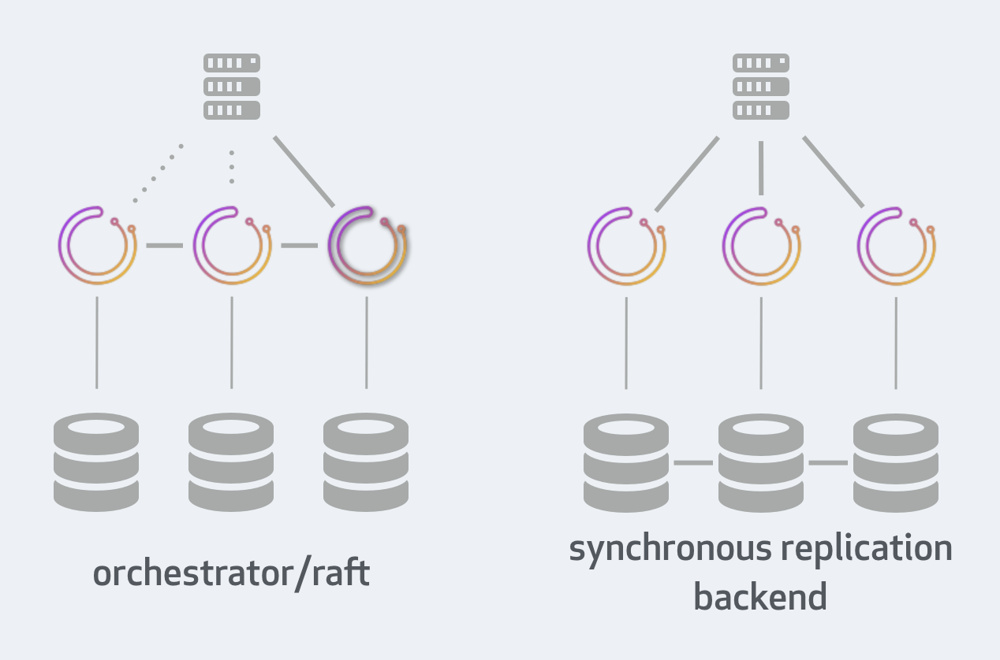

# orchestrator/raft vs. synchronous replication setup
# [orchestrator/raft vs. synchronous replication setup](https://github.com/openark/orchestrator/blob/master/docs/raft-vs-sync-repl.md)
这篇文章比较了两种高可用性部署方法的部署、行为、限制和好处: `orchestrator/raft` vs `orchestrator/[galera|xtradb cluster|innodb cluster]`

我们将假设和比较:

* `3`个数据中心的部署设置(一个可用区可以算作一个数据中心)
* `3` 节点`orchestrator/raft` setup
* `3` 节点`orchestrator` 在多主模式`galera|xtradb cluster|innodb cluster`上(集群中的每个MySQL都可以接受写)
* 一个能够运行`HTTP`或`mysql`健康检查的代理
>  A proxy able to run `HTTP` or `mysql` health checks
* `MySQL`、`MariaDB`、`Percona Server`都被认为是`MySQL` .

|**Compare**|**orchestrator/raft**|**synchronous replication backend**|
| ----- | ----- | ----- |
|General wiring (一般布线? 总体布线?)|每个`orchestrator` 节点都有一个私有后端数据库; `orchestrator` 节点间通过`raft` 协议通信|每个`orchestrator` 节点连接到一个"同步复制集群"的不同`MySQL` 成员上. `orchestrator` 节点之间不进行通信|
|Backend DB (后端数据库)|`MySQL` 或 `SQLite`|MySQL|
|Backend DB dependency (后端数据库依赖性)|如果不能访问自己的私有后端数据库, 服务就会panic|如果不能访问自己的私有后端数据库, 则服务处于*unhealthy状态*|
|DB data (数据库数据)|Independent across DB backends.  May vary, but on a stable system converges to same overall picture 每个私有数据库的数据都是独立的.  可能会有所不同, 但在一个稳定的系统上各个私有数据库的数据会收敛到近乎相同.|单一数据集,因为是"同步复制集群"|
|DB access (数据库访问)|请永远不要直接写入数据. 只有`raft`节点在协调/合作时访问后端数据库. 否则会引入不一致的情况. 读取是可以的.|可以直接访问和写入;  所有`orchestrator`节点/clients看到的是完全相同的数据|
|Leader and actions|Single leader. 只有leader运行故障恢复功能. > Only the leader runs recoveries 所有节点都运行发现(探测)和自我分析 > All nodes run discoveries (probing) and self-analysis|Single leader.  只有领导者负责发现(探测)、分析和恢复工作. > Only the leader runs discoveries (probing), analysis and recoveries.|
|HTTP Access|必须只访问leader（可以通过proxy或`orchestrator-client`来执行） > can be enforced by proxy or `orchestrator-client`|可以访问任何健康的节点(可以通过proxy强制执行). 为了保证读取的一致性, 最好只与leader对话（可由proxy或`orchestrator-client`来执行）|
|Command line|HTTP/API access (e.g. `curl`, `jq`) or  `orchestrator-client` script which wraps common HTTP /API calls with familiar command line interface|HTTP/API, and/or `orchestrator-client` script, or `orchestrator ...` command line invocation.|
|Install|`orchestrator` service on service nodes only.  `orchestrator-client` script anywhere (requires access to HTTP/API).|`orchestrator` service on service nodes. `orchestrator-client` script anywhere (requires access to HTTP/API).  `orchestrator` client anywhere (requires access to backend DBs)|
|Proxy|HTTP. Must only direct traffic to the leader (`/api/leader-check`)|HTTP. Must only direct traffic to healthy nodes (`/api/status`) ;  best to only direct traffic to leader node (`/api/leader-check`)|
|No proxy|Use `orchestrator-client` with all `orchestrator` backends.  `orchestrator-client` will direct traffic to master.|Use `orchestrator-client` with all `orchestrator` backends.  `orchestrator-client` will direct traffic to master.|
|Cross DC (跨数据中心部署)|每个`orchestrator` 节点(以及私有后端数据库)可以在不同DC上运行. 节点之间的通信不多, 流量也很低.|每个`orchestrator` 节点(以及私有后端数据库)可以在不同DC上运行. `orchestrator` 节点间不直接通信. `MySQL` group replication is chatty. Amount of traffic mostly linear by size of topologies and by polling rate. Write latencies.|
|Probing (探查, 数据库服务发现)|Each topology server probed by all `orchestrator` nodes 每个拓扑服务器由所有`orchestrator`节点探查|Each topology server probed by the single active node 每个拓扑服务器由单个活动节点探查|
|Failure analysis|由所有节点独立执行|仅由leader执行(数据库是共享的, 因此所有节点无论如何都会看到完全相同的数据).|
|Failover|仅由leader节点执行|仅由leader节点执行|
|Resiliency to failure|3节点集群容忍1个节点宕机 5节点集群容忍2个节点宕机|3节点集群容忍1个节点宕机 5节点集群容忍2个节点宕机|
|Node back from short failure (节点从短时故障中恢复)|Node rejoins cluster, gets updated with changes. 节点重新加入集群.|DB node rejoins cluster, gets updated with changes. 节点重新加入集群.|
|Node back from long outage (节点从长期中断中恢复)|DB must be cloned from healthy node. 数据库需要从其他健康节点的备份中恢复|Depends on your MySQL backend implementation. Potentially SST/restore from backup. 取决于你的MySQL后端实现. 可能通过SST或从备份中恢复.|

### 注意事项
以下是在这两种部署方法中选择的考虑因素:

* 你只有一个单一的数据中心(DC): 选择shared DB(MGR/PXC)或甚至更简单的部署方式(参考[[Orchestrator高可用 id=&#39;ed5e7b21-c508-44b8-817e-d7c782082cf3&#39;]])
* 你对Galera/XtraDB Cluster/InnoDB Cluster很熟悉, 并且有自动化部署和维护它们的能力: 挑选shared DB.
* 你有高延迟的跨DC网络: 选择`orchestrator/raft`.
* 你不想为`orchestrator` 使用MySQL: choose `orchestrator/raft` with `SQLite` backend.
* 你要管理数千个MySQL集群, 选择raft或shard DB都行. 但是后端数据库请选择MySQL, 而不是SQLite, 因为前者性能更好.

> 译者注: raft和shared DB 各有优缺点, 都可以. 如果要将orchestrator跨云部署(部署在华为和阿里), 那么选raft. 否则如果只是跨AZ部署, 以华为AZ间的网络延迟来看, raft意义不大.

### Notes
* Another synchronous replication setup is that of a single writer. This would require an additional proxy between the `orchestrator` nodes and the underlying cluster, and is not considered above.
`orchestrator` -> proxysql -> MySQL集群(如主从复制)

